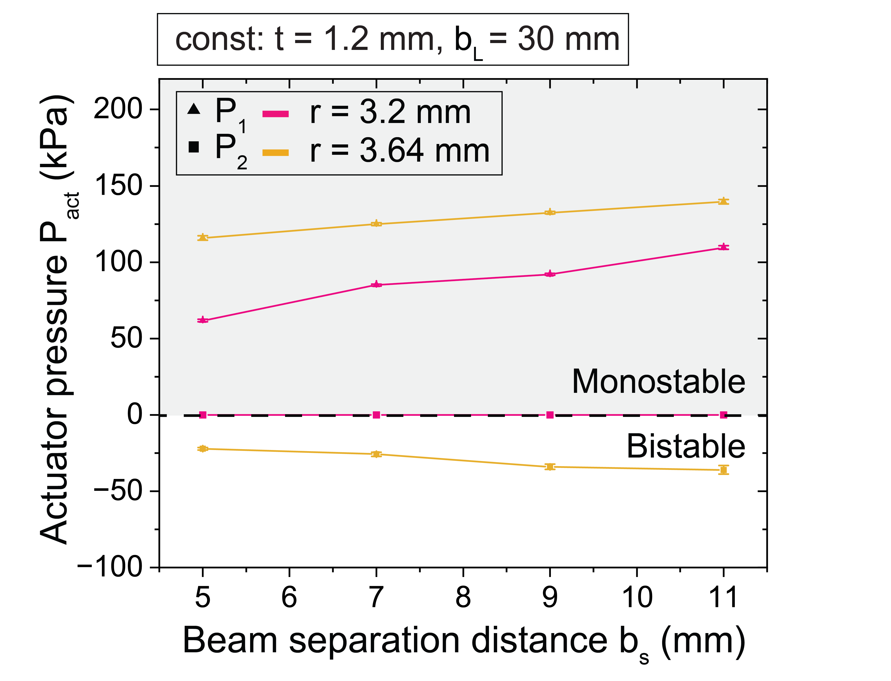

## Analysis of the impact of beam thickness variations on the operating pressure and stability states of the compliant logic device:

## Analysis of the impact of beam length variations on the operating pressure and stability states of the compliant logic device:

## Analysis of the impact of beam separation distance variations on the operating pressure and stability states of the compliant logic device:

## Analysis of the impact of beam angle variations on the operating pressure and stability states of the compliant logic device:

