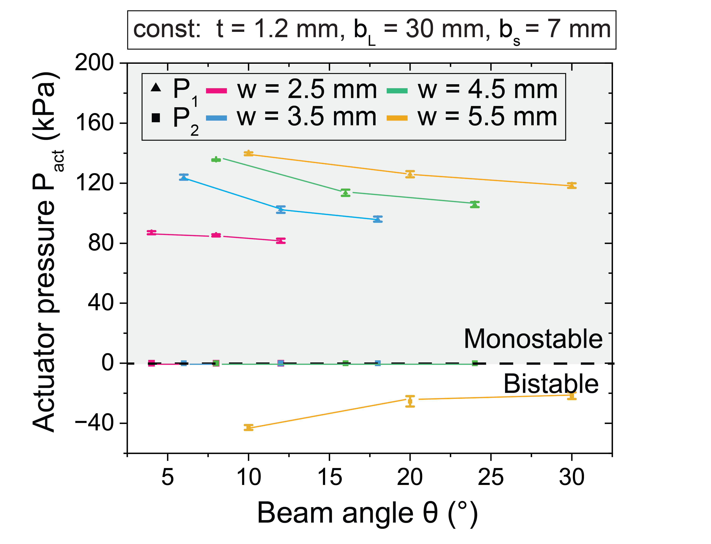

## Analysis of the impact of beam thickness variations on the operating pressure and stability states of the compliant logic device:
**Note: All units are in kPa**

### Data Table

| X   | Mean (P1, r = 3.2) | SD (P1, r = 3.2) | 5*SD (P1, r = 3.2) | Mean (P2, r = 3.2) | SD (P2, r = 3.2) | 5*SD (P2, r = 3.2) | Mean (P1, r = 3.43) | SD (P1, r = 3.43) | 5*SD (P1, r = 3.43) | Mean (P2, r = 3.43) | SD (P2, r = 3.43) | 5*SD (P2, r = 3.43) | Mean (P1, r = 3.56) | SD (P1, r = 3.56) | 5*SD (P1, r = 3.56) | Mean (P2, r = 3.56) | SD (P2, r = 3.56) | 5*SD (P2, r = 3.56) | Mean (P1, r = 3.43) | SD (P1, r = 3.43) | 5*SD (P1, r = 3.43) | Mean (P2, r = 3.43) | SD (P2, r = 3.43) | 5*SD (P2, r = 3.43) |
|-----|--------------------|-----------------|-------------------|--------------------|-----------------|-------------------|--------------------|-----------------|-------------------|--------------------|-----------------|-------------------|--------------------|-----------------|-------------------|--------------------|-----------------|-------------------|--------------------|-----------------|-------------------|--------------------|-----------------|-------------------|
| 0.60| 44.60              | 1.36            | 6.78233           | 0.00               | 0.00            | 0                 | 55.20              | 2.14            | 10.67708          | 0.00               | 0.00            | 0                 | 74.4               | 2.05913         | 10.29563          | 0.00               | 0.00            | 0                 | 84.8               | 1.72047         | 8.60233           | -18.80             | 2.86            | 14.32             |
| 0.90| 57.20              | 1.17            | 5.83095           | 0.00               | 0.00            | 0                 | 83.80              | 0.75            | 3.74166           | 0.00               | 0.00            | 0                 | 82.4               | 1.01980         | 5.09902           | 0.00               | 0.00            | 0                 | 95.6               | 1.62481         | 8.12404           | -40.00             | 2.24            | 11.18             |
| 1.20| 82.00              | 0.89            | 4.47214           | 0.00               | 0.00            | 0                 | 97.00              | 1.41            | 7.07107           | 0.00               | 0.00            | 0                 | 83.8               | 1.72047         | 8.60233           | 0.00               | 0.00            | 0                 | 124.6              | 2.05913         | 10.29563          | -23.40             | 1.14            | 5.70              |
| 1.50| 112.40             | 2.15            | 10.77033          | 0.00               | 0.00            | 0                 | 123.20             | 1.33            | 6.63325           | 0.00               | 0.00            | 0                 | 111.2              | 2.03961         | 10.19804          | 0.00               | 0.00            | 0                 | 162                | 2.00            | 10.00             | -46.20             | 1.64            | 8.22              |
| 1.80| 156.00             | 3.10            | 15.49193          | 0.00               | 0.00            | 0                 | 165.00             | 1.41            | 7.07107           | 0.00               | 0.00            | 0                 | 149.8              | 2.99333         | 14.96663          | 0.00               | 0.00            | 0                 | 195                | 1.26491         | 6.32456           | 0.00               | 0.00            | 0.00             |

## Analysis of the impact of beam length variations on the operating pressure and stability states of the compliant logic device:

### Data Table

| Measurement | Mean (r = 3.2) | Standard Deviation (r = 3.2) | 5*SD (r = 3.2) | Mean (r = 3.64) | Standard Deviation (r = 3.64) | 5*SD (r = 3.64) |
|-------------|----------------|------------------------------|----------------|-----------------|------------------------------|-----------------|
| 20          | 134            | 0.632456                     | 3.162278       | 144             | 1.414214                     | 7.071068        |
| 25          | 115.6          | 1.356466                     | 6.782330       | 128             | 0.632456                     | 3.162278        |
| 30          | 84             | 0.894427                     | 4.472136       | 116.8           | 1.166190                     | 5.830952        |
| 35          | 81.2           | 0.748331                     | 3.741657       | 111.8           | 2.227106                     | 11.135529       |
| 40          | 75.6           | 0.489898                     | 2.449490       | 106.8           | 1.166190                     | 5.830952        |

## Analysis of the impact of beam separation distance variations on the operating pressure and stability states of the compliant logic device:

### Data Table

| Measurement | Mean (P1, r = 3.2) | Standard Deviation (P1, r = 3.2) | 5*SD (P1, r = 3.2) | Mean (P2, r = 3.2) | SD (P2, r = 3.2) | SD (P2, r = 3.2) | Mean (P1, r = 3.64) | Standard Deviation (P1, r = 3.64) | 5*SD (P1, r = 3.64) | Mean (P2, r = 3.64) | SD (P2, r = 3.64) | 5*SD (P2, r = 3.64) |
|-------------|--------------------|-------------------------------|-----------------|----------------|-----------------|-----------------|--------------------|-------------------------------|-----------------|----------------|-----------------|-----------------|
| 5           | 71.8               | 0.748331                      | 3.741657        | 0              | 0               | 0               | 121                | 1.414214                      | 7.071068        | -22.2          | 0.748331       | 3.741657        |
| 7           | 85                 | 0.632456                      | 3.162278        | 0              | 0               | 0               | 125                | 0.894427                      | 4.472136        | -25.8          | 1.326650       | 6.633250        |
| 9           | 87                 | 0.632456                      | 3.162278        | 0              | 0               | 0               | 132.4              | 0.8                           | 4               | -34            | 1.673320       | 8.366600        |
| 11          | 101                | 1.414214                      | 7.071068        | 0              | 0               | 0               | 139.6              | 1.496663                      | 7.483315        | -36            | 2.828427       | 14.142136       |

## Analysis of the impact of beam angle variations on the operating pressure and stability states of the compliant logic device:
<!--   -->

## Data Table

**All units are in kPa**

### P1, r = 3.2 and P2, r = 3.2

| Measurement | Mean (P1) | SD (P1) | 5*SD (P1) | Mean (P2) | SD (P2) | 5*SD (P2) |
|-------------|------------|---------|-----------|-----------|---------|-----------|
| 4           | 87         | 1.095   | 5.477     | 0         | 0       | 0         |
| 8           | 85.2       | 0.748   | 3.742     | 0         | 0       | 0         |
| 12          | 81.6       | 1.356   | 6.782     | 0         | 0       | 0         |

### P1, r = 3.43 and P2, r = 3.43

| Measurement | Mean (P1) | SD (P1) | 5*SD (P1) | Mean (P2) | SD (P2) | 5*SD (P2) |
|-------------|------------|---------|-----------|-----------|---------|-----------|
| 6           | 124        | 1.673   | 8.367     | 0         | 0       | 0         |
| 12          | 102.4      | 2.154   | 10.770    | 0         | 0       | 0         |
| 18          | 96         | 1.673   | 8.367     | 0         | 0       | 0         |

### P1, r = 3.56 and P2, r = 3.56

| Measurement | Mean (P1) | SD (P1) | 5*SD (P1) | Mean (P2) | SD (P2) | 5*SD (P2) |
|-------------|------------|---------|-----------|-----------|---------|-----------|
| 8           | 135.4      | 0.490   | 2.449     | 0         | 0       | 0         |
| 16          | 113.6      | 2.059   | 10.296    | 0         | 0       | 0         |
| 24          | 105.8      | 1.720   | 8.602     | 0         | 0       | 0         |

### P1, r = 3.64 and P2, r = 3.64

| Measurement | Mean (P1) | SD (P1) | 5*SD (P1) | Mean (P2) | SD (P2) | 5*SD (P2) |
|-------------|------------|---------|-----------|-----------|---------|-----------|
| 10          | 139.6      | 1.020   | 5.099     | -42.8     | 1.6     | 8         |
| 20          | 126        | 2.000   | 10.000    | -25.4     | 3.441   | 17.205    |
| 30          | 118.4      | 1.497   | 7.483     | -21.6     | 2.154   | 10.770    |
